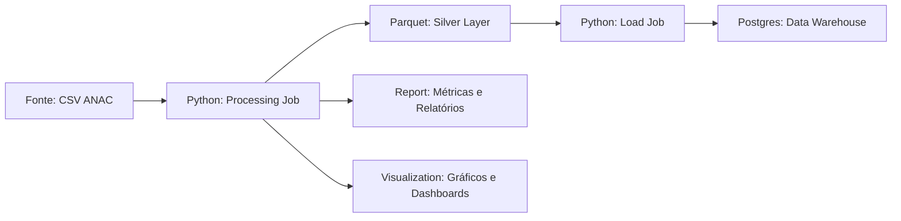

# Lab01_PART1_NUSP
Repo público no github: [link](https://github.com/gustavocn121/Lab01_PART1_NUSP)

## 1. Arquitetura



## 2. Documentação da Tarefa

- Ingestion:
  - Conexão com o kagglehub.
  - Download dos dados brutos da ANAC.
- Processing Job (`src/processing/job.py`):
  - Limpeza de dados: padronização de tipos, tratamento de separadores decimais, datas.
  - Tratamento de valores nulos e duplicados.
  - Exportação da camada Silver em formato Parquet.
  - Uso de `schema.py` para definição de tipos esperados.
- Report (src/processing/report.py):
  - Geração de relatório de caracterização.
  - Análise de qualidade de dados.
  - Geração de métricas por coluna.
  - Criação de relatórios tabulares
- Visualization (`src/processing/visualization.py`):
  - Criação de gráficos.
- Load Job (src/load/job.py):
    - Leitura dos arquivos Parquet da camada Silver.
  - Inserção em tabelas do Postgres:
    - `dim_data`
    - `dim_empresa`
    - `dim_aeroporto`
    - `fato_voos`

- Scripts auxiliares:
  - schema.py define os tipos esperados das colunas.
  - report.py gera métricas de qualidade de dados.
  - visualization.py cria gráficos exploratórios.

## 3. Dicionário de Dados

Coluna                     | Tipo       | Descrição
----------------------------|------------|-----------
id_basica                   | Int32      | Identificador único do voo
id_empresa                  | Int32      | ID da companhia aérea
sg_empresa_icao             | String     | Código ICAO da empresa
sg_empresa_iata             | String     | Código IATA da empresa
nm_empresa                  | String     | Nome da empresa aérea
nm_pais                     | String     | País da empresa
dt_referencia               | Date       | Data de referência do voo
nr_decolagem                | Int32      | Número de decolagens
nr_passag_pagos             | Int32      | Passageiros pagos
nr_passag_gratis            | Int32      | Passageiros gratuitos
kg_carga_paga               | Float32    | Carga paga em kg
km_distancia                | Float32    | Distância percorrida em km
id_aerodromo_origem         | Int16      | ID do aeroporto de origem
id_aerodromo_destino        | Int16      | ID do aeroporto de destino
nr_horas_voadas             | Float16    | Horas voadas
nr_velocidade_media         | Float16    | Velocidade média do voo

## 4. Qualidade de Dados

- **sg_empresa_iata**: 559.947 nulos -> ~2,5% das linhas.
- **nm_pais**: 184 nulos -> % muito pequeno.
- **nr_singular**: 224.985 nulos -> ~1% das linhas não possuem número singular do voo.
- **id_arquivo** e **nm_arquivo**: 1.420.081 nulos
- **id_aerodromo_origem** / **id_aerodromo_destino**: 21.473 nulos -> aproximadamente 0,1% dos voos não têm aeroporto associado.
- **nr_decolagem**: 1.780.441 nulos -> ~8% dos voos não têm registro de decolagem, impactando métricas de quantidade de voos.
- **kg_payload** e **kg_carga_paga**: mais de 356.383 nulos -> ~1,6% dos registros sem peso de carga.
- **nr_passag_pagos**: 214.985 nulos -> ~1% dos registros sem passageiros pagantes.
- **nr_passag_gratis**: 100.1252 nulos -> registros sem passageiros gratuitos.
- **nr_horas_voadas** e **nr_velocidade_media**: 417.106 e 356.383 nulos -> cerca de 1,6% dos registros sem dados de voo ou velocidade média.

## 5. Instruções de Execução

1. Docker
Com o docker configurado e rodando na sua maquina, execute:
```bash
docker-compose up
```

2. Python
Em seguida, é só seguir o passo a passo a baixo para executar o python:
```bash
git clone https://github.com/gustavocn121/Lab01_PART1_NUSP.git
cd Lab01_PART1_NUSP
python -m venv .venv
source .venv/bin/activate  # Linux/macOS
# .venv\Scripts\activate   # Windows

pip install -r requirements.txt

python -m src.main
```
3. Métricas de negócio e gráficos
- Os gráficos gerado estão disponíveis em [`docs/plots`](docs/plots)
- O arquivo markdown contendo elas está em [`docs/graficos.md`](docs/graficos.md)
- A query com as métricas de negócio e suas respectivas queries estão disponíveis em [`docs/metricas.md`](docs/metricas.md)
